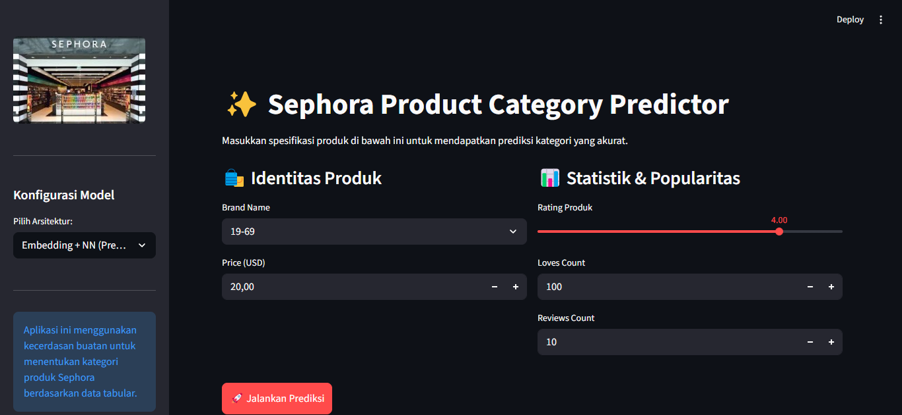

# ✨ Sephora Product Classifier: Multi-Model Machine Learning✨ 

## 📝 Deskripsi Proyek
Proyek ini bertujuan untuk mengklasifikasikan kategori produk kecantikan dari platform Sephora menggunakan tiga arsitektur Neural Network yang berbeda. Fokus utamanya adalah membandingkan performa arsitektur Neural Network dasar (MLP), model berbasis perhatian (TabNet), dan teknik Entity Embedding dalam menangani data tabular produk kecantikan. Sistem ini dilengkapi dengan antarmuka berbasis web untuk prediksi interaktif.

## 📊 Dataset dan Preprocessing
**Dataset Kaggle :**

Judul Dataset: Classification with an Academic Success Dataset

Link: https://www.kaggle.com/datasets/nadyinky/sephora-products-and-skincare-reviews

Deskripsi: Data set ini dikumpulkan menggunakan scraper Python pada Maret 2023 dan berisi informasi tentang semua produk kecantikan (lebih dari 8.000) dari toko online Sephora, termasuk nama produk dan merek, harga, bahan, ulasan, dan semua fitur.

**Pemilihan Kolom/Atribut :**

Atribut yang digunakan dalam project ini adalah 6 Kolom dari 27 Kolom yang ada didalam Dataset yang digunakan. Kolom-kolom tersebut dijelaskan pada tabel dibawah ini.

| Kolom | Deskripsi |
| :--- | :--- |
| brand_name | Nama lengkap merk brand | 
| loves_count | Jumlah orang yang telah menandai produk ini sebagai favorit |
| rating | Rating rata-rata produk berdasarkan ulasan pengguna |
| reviews | Jumlah ulasan pengguna untuk produk ini |
| price_usd | Harga produk dalam dolar AS |
| primary_category | Kategori pertama di bagian breadcrumb |

**Preprocessing:**
1. **Cleaning:** Menghapus data null dan membatasi pada 10 kategori produk teratas untuk memastikan kualitas label.
2. **Encoding:** Menggunakan `LabelEncoder` untuk mengubah data kategorikal (Brand) dan Target (Category) menjadi numerik.
3. **Feature Scaling:** Menerapkan `StandardScaler` pada fitur numerik (Price, Loves, Rating, Reviews) agar berada pada skala yang sama.
4. **Data Splitting:** Membagi data menjadi 80% pelatihan dan 20% pengujian.


## 🤖 Penjelasan Model
Implementasi tiga model berbeda untuk dievaluasi:

1. **Model 1: Multilayer Perceptron (MLP)**
   - Arsitektur Neural Network dasar dengan beberapa layer Dense dan Dropout untuk mencegah overfitting. Digunakan sebagai *baseline*.
2. **Model 2: TabNet**
   - Model *deep learning* yang dirancang khusus untuk data tabular menggunakan mekanisme *Sequential Attention* untuk memilih fitur-fitur yang paling relevan secara dinamis.
3. **Model 3: Entity Embedding + NN**
   - Model ini menggunakan *Embedding Layer* khusus untuk menangani fitur brand, yang kemudian digabungkan (*Concatenate*) dengan data numerik sebelum masuk ke layer Dense.

## 📈 Hasil Evaluasi dan Analisis Perbandingan
Berdasarkan hasil pengujian, berikut adalah performa ketiga model:

| Nama Model | Akurasi | Hasil Analisis |
| :--- | :---: | :--- |
| **Model 1: MLP** | **50%** | Berfungsi sebagai baseline. Lemah dalam mengenali kelas kecil dan memiliki akurasi yang moderat pada data numerik. |
| **Model 2: TabNet** | **51%** | Menunjukkan sedikit peningkatan akurasi dibandingkan MLP, namun masih kesulitan pada kategori dengan sampel sedikit (*support* rendah). |
| **Model 3: Embedding** | **83%** | **Model Terbaik.** Lonjakan akurasi signifikan terjadi karena penggunaan embedding yang mampu menangkap hubungan semantik antar brand dengan lebih baik. |


## 💻 Sistem Website Sederhana 
Aplikasi web ini dibangun menggunakan Streamlit, sebuah framework Python yang memungkinkan transformasi skrip machine learning menjadi dashboard interaktif secara efisien.
1. Panel Konfigurasi (Sidebar Kiri) Pemilihan Arsitektur Model
   
   Panel Input Data (Main Page) Identitas Produk, Statistik dan Popularitas
   


2. Prediction Card (Hasil) Kategori Terdeteksi dan Informasi Model


## 🔧 Panduan Menjalankan Secara Lokal

Ikuti langkah-langkah berikut untuk menjalankan website prediksi di komputer Anda:

### 1. Clone Repository
```bash
git clone [https://github.com/prawesti/sephora-product-classifier.git](https://github.com/prawesti/sephora-product-classifier.git)
cd sephora-product-classifier
